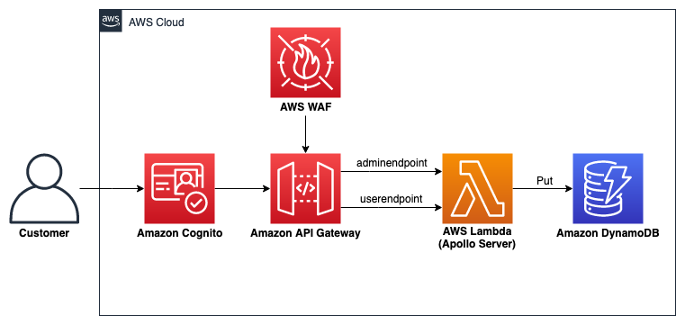
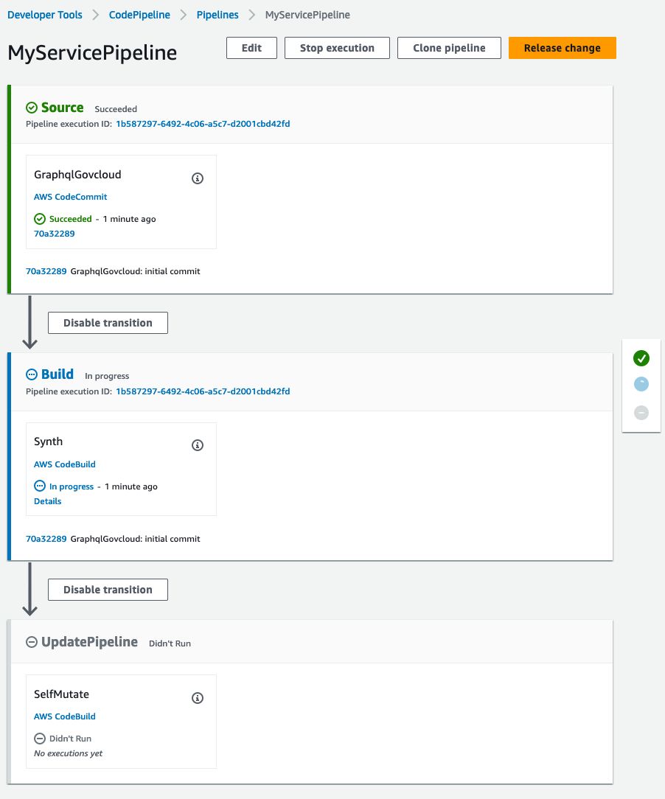
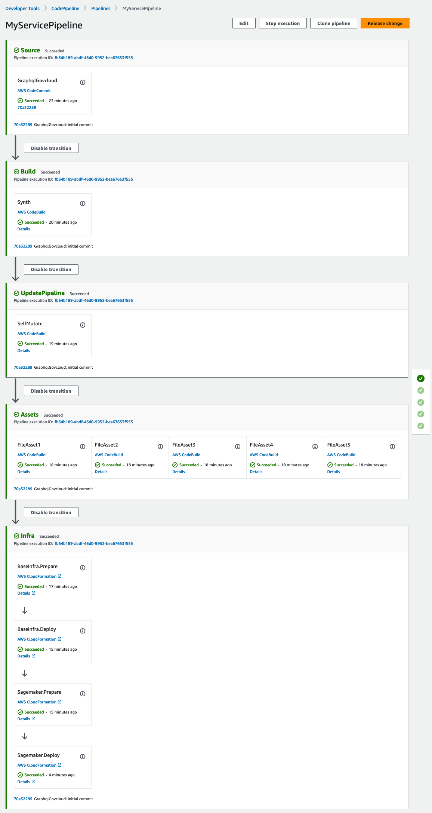

# Implementation of GraphQL based architectures in AWS GovCloud(US) to support missions
<h3 align="center">
  <a href="#requirements">Requirements</a> •
  <a href="#reference-architecture">Reference Architecture</a> •
  <a href="#installation-instructions">Installation</a> •
  <a href="#cleanup">Cleanup</a>
</h3>
<p>

Important: this application uses various AWS services and there are costs associated with these services after the Free Tier usage - please see the [AWS Pricing page](https://aws.amazon.com/pricing/) for details. You are responsible for any AWS costs incurred. No warranty is implied in this example.
</p>

## Differences from `main` branch

1. Utilizes the [CDK Pipelines](https://docs.aws.amazon.com/cdk/v2/guide/cdk_pipeline.html) construct library, with more robust features around CDK application development. Refer to the [CDK Pipelines blog post](https://aws.amazon.com/blogs/developer/cdk-pipelines-continuous-delivery-for-aws-cdk-applications/).
2. Avoids use of the experimental [sagemaker-alpha](https://docs.aws.amazon.com/cdk/api/v2/docs/aws-sagemaker-alpha-readme.html) construct library in `sagemakerendpoint-stack.ts`
3. Consolidates base infrastructure and sagemaker infrastructure cdk apps into a singular cdk application

---

## Requirements

* An [AWS GovCloud (US)](https://aws.amazon.com/govcloud-us/?whats-new-ess.sort-by=item.additionalFields.postDateTime&whats-new-ess.sort-order=desc) account. ([Create a GovCloud account](https://docs.aws.amazon.com/govcloud-us/latest/UserGuide/getting-started-sign-up.html) if you do not already have one and login.). **Note:** A GovCloud account is not required, as this project can be deployed to an AWS standard account. GovCloud is recommended, in order to follow along with the content presented in the blog mentioned earlier. If an AWS standard account is preferred, then [Create an AWS standard account](https://portal.aws.amazon.com/gp/aws/developer/registration/index.html) and log in.
* AWS CLI already configured with appropriate permissions to build and deploy [CDK](https://docs.aws.amazon.com/cdk/v2/guide/getting_started.html)
* [NodeJS 14.x installed](https://nodejs.org/en/download/)
* [AWS Cloud Development Kit (AWS CDK) v2 installed](https://docs.aws.amazon.com/cdk/v2/guide/getting_started.html) *minimum version 2.84*.

## Reference Architecture



## Installation Instructions

1. Clone the repo onto your local development machine:
```
git clone -b pipeline https://github.com/aws-samples/aws-govcloud-graphql
```

### 1. Set up infrastructure
Note: This solution assumes that the Generative AI model is previously provided by data scientists, and the ML model training and tuning is outside the scope of this solution.
1. [Create a CodeCommit repository](https://docs.aws.amazon.com/codecommit/latest/userguide/getting-started.html#getting-started-create-repo) to upload project files to.
2. Create an S3 Bucket, and upload *model.tar.gz* into the S3 Bucket.
3. Before deploying, some configuration parameters have to be updated. The configurations are in the `config.json` file in the base directory of this solution. 
    - Replace `<CODECOMMIT-REPO>` with the name of the repository from Step 1.
    - Replace `<BUCKET-NAME>` with the name of the bucket from Step 2.
    - You may need to change the name of the DynamoDB table to be created, in case a table with that name ("missions") exists already. 


```json
{
    "CodeCommit": {
        "RepoName": "<CODECOMMIT-REPO>"
    },
    "Database": {
        "TableName": "missions"
    },
    "Cognito" : {
        "AdminScope": "adminusers/*"
    },
    "GenAIModel" : {
        "BucketName" : "<BUCKET-NAME>"
    }
}
```


4. Deploy the pipeline stack via `cdk deploy`. During the following prompt, `Do you wish to deploy these changes (y/n)?`, enter *y*, to enable the infrastructure to deployed. A CodePipeline will initially be deployed with 3 stages. These stages pull the CDK application from the CodeCommit repository in the `Source` stage, synthesize the application in the `Build` stage, and determine if there are addtional stages that need to be added to the pipeline in the `UpdatePipeline` stage.

<p align="center"></p>

### 2. Starting the pipeline

1. Uncomment the section of code in `pipeline-stack.ts` that adds a new stage to the pipeline
```typescript
    ...

    // This is where we add the application stages

    pipeline.addStage(new CdkpipelinesDemoStage(this, 'Infra', {}));
```
2. [Commit](https://docs.aws.amazon.com/codecommit/latest/userguide/getting-started.html#getting-started-create-commit) and [push](https://docs.aws.amazon.com/codecommit/latest/userguide/getting-started.html#getting-started-init-repo) and the entire project to the CodeCommit repository created in step 1 of **Set up infrastructure**. After these changes are pushed, the pipeline will self-mutate and add an `Assets` stage where Lambda functions are packaged and an `Infra` stage where the **Reference Architecture** is deployed:

<p align="center"></p>

## Cleanup

1. Manually delete any objects in the S3 buckets created in step 1 of the installation instructions.
2. Destroy the CDK pipeline
```sh
cdk destroy
```
During the following prompt, `Are you sure you want to delete: <Stack Name> (y/n)`, enter *y* to enable the infrastructure to destroyed.
3. Manually delete the CloudFormation stacks deployed by the pipeline (Infra-BaseInfra and Infra-Sagemaker)

3. There may be additional cleanup required, for resources created in the steps mentioned in this README (e.g. The S3 bucket hosting the ML Model or CodeCommit repository), or in the blog. Please follow the cleanup notes in the blog as applicable.

If you have any questions, please contact the author or raise an issue in the GitHub repo.

## Known Issues
- You may have to request for a quota increase a CodeBuild limit (Concurrently running builds for Linux/Small environment) so the lambda functions can be properly packaged in the build stage of the pipeline.
- Updating the Cognito user pool can result in an error noting, `User pool already has a domain configured`. This is a known [bug](https://github.com/aws/aws-cdk/issues/10062).

==============================================

Copyright 2021 Amazon.com, Inc. or its affiliates. All Rights Reserved.

SPDX-License-Identifier: MIT-0
